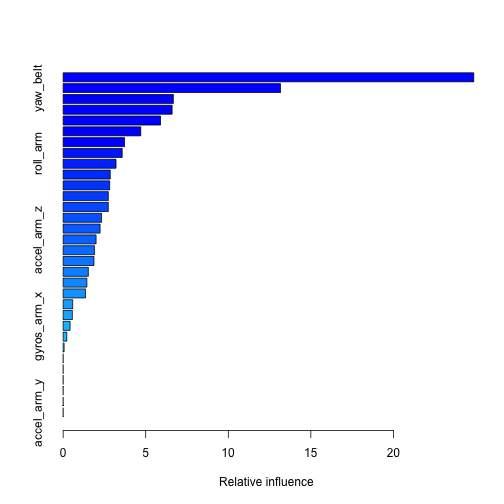
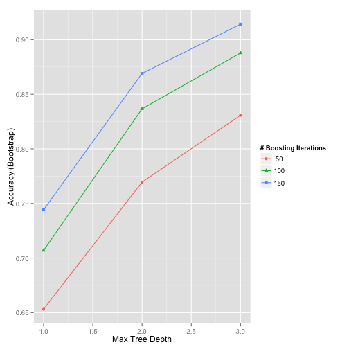

---
title: "Machine Learning_Project"
author: "Dr. D. Weissman-Miller"
date: "March 16, 2015"
output: html_document
---

## Introduction

Using devices such as Jawbone Up, Nike FuelBand, and Fitbit it is now possible to collect a large amount of data about personal activity relatively inexpensively. These type of devices are part of the quantified self movement – a group of enthusiasts who take measurements about themselves regularly to improve their health, to find patterns in their behavior, or because they are tech geeks. One thing that people regularly do is quantify how much of a particular activity they do, but they rarely quantify how well they do it. In this project, your goal will be to use data from accelerometers on the belt, forearm, arm, and dumbell of 6 participants. They were asked to perform barbell lifts correctly and incorrectly in 5 different ways. More information is available from the website here: http://groupware.les.inf.puc-rio.br/har (see the section on the Weight Lifting Exercise Dataset).

The goal of this project is to predict the manner of performing unilateral dumbbell biceps curls based on data from accelerometers on the belt, forearm, arm, and dumbell of 6 participants includeing:

A: exactly according to the specification
B: throwing the elbows to the front
C: lifting the dumbbell only halfway
D: lowering the dumbbell only halfway
E: throwing the hips to the front

## Building the Model
The first step is to prepare the datasets and remove the first ID variable so that it does not interfere with the ML algorithims, then to examine the data, and then to remove excess NA's.

### Setup working directory and prepare the datasets


```r
setwd("~/Documents/MachineLearning_ Project")
library(caret)
library(lattice)
library(ggplot2)
library(plyr)
library(sandwich)

train <- read.csv("~/Documents/MachineLearning_ Project/pml-training.csv")
test <- read.csv("~/Documents/MachineLearning_ Project/pml-testing.csv")

train <- train[,-1]
test <- test[,-1]
```
### Examine the train dataset


```r
head(train, n=10)
names(train)
```
### remove columns with too many NA's which are useless or empty variables for this prediction.


```r
col2remove <- apply(!is.na(train), 2, sum)>5000
train <- train[,col2remove]
test <- test[,col2remove]

train$user_name <- factor(train$user_name)
train$cvtd_timestamp <-  factor(train$cvtd_timestamp)
train$new_window <- factor(train$new_window)
train$classe <- factor(train$classe)

test$user_name <- factor(test$user_name)
test$cvtd_timestamp <-  factor(test$cvtd_timestamp)
test$new_window <- factor(test$new_window)
```
### create numeric data columns


```r
numeric_cols <- sapply(train, is.numeric)
```

### preprocessing for training data


```r
prep <- preProcess(train[, numeric_cols], method = c("center","scale","medianImpute"))
newTrain <- predict(prep, train[, numeric_cols])
newTrain <- cbind(user_name=train$user_name,cvtd_timestamp=train$cvtd_timestamp,new_window=train$new_window,newTrain)
```

### preprocessing for testing data


```r
newTest <- predict(prep, test[, numeric_cols])
newTest <- cbind(user_name=test$user_name,cvtd_timestamp=test$cvtd_timestamp,new_window=test$new_window,newTest)
```

## Training the model
### The inital model 'training' is first trained using a generalized boosted model (with trees) 'gbm' to examine the machine learning possibilities with this dataset and to predict on an initial subsample of the 'train' dataset. Boosting is selected because of the somewhat sparse data which would be augmented by building the model in a stage-wise fashion. The second step uses a reduced model set 'newTrain' where cross-validation is used to select the best final model.  


```r
set.seed(1203458)
inTrain = createDataPartition(train$classe, p = 0.9, list=FALSE)
training = train[inTrain,]
testing = train[-inTrain,]
dim(training); dim(testing)
```

```
## [1] 17662    92
```

```
## [1] 1960   92
```

```r
## The following code has been fitted due to lack of variance in variables such as kurtosis_yaw_dumbell, where there were 50 warnings showing no variation.

modFit <- train(classe ~ user_name + pitch_arm + yaw_arm + roll_arm + roll_belt + pitch_belt + yaw_belt + gyros_belt_x + gyros_belt_y +  gyros_belt_z + accel_belt_x + accel_belt_y + accel_belt_z + magnet_belt_x + magnet_belt_y + magnet_belt_z + gyros_arm_x + gyros_arm_y + gyros_arm_z + accel_arm_x + accel_arm_y + accel_arm_z + magnet_arm_x + magnet_arm_y + magnet_arm_z + roll_dumbbell + pitch_dumbbell + yaw_dumbbell, method="gbm", data=training, verbose=FALSE)

print(modFit)
```

```
## Stochastic Gradient Boosting 
## 
## 17662 samples
##    91 predictor
##     5 classes: 'A', 'B', 'C', 'D', 'E' 
## 
## No pre-processing
## Resampling: Bootstrapped (25 reps) 
## 
## Summary of sample sizes: 17662, 17662, 17662, 17662, 17662, 17662, ... 
## 
## Resampling results across tuning parameters:
## 
##   interaction.depth  n.trees  Accuracy   Kappa      Accuracy SD
##   1                   50      0.6531086  0.5577615  0.006705515
##   1                  100      0.7070011  0.6280242  0.007463913
##   1                  150      0.7441733  0.6757900  0.005971435
##   2                   50      0.7695182  0.7080313  0.006711945
##   2                  100      0.8366448  0.7932443  0.005355716
##   2                  150      0.8691054  0.8343796  0.004859391
##   3                   50      0.8307104  0.7857338  0.006902322
##   3                  100      0.8878512  0.8581076  0.004640314
##   3                  150      0.9142169  0.8914974  0.003747050
##   Kappa SD   
##   0.008468259
##   0.009465034
##   0.007520541
##   0.008393088
##   0.006762970
##   0.006134562
##   0.008661369
##   0.005826360
##   0.004704058
## 
## Tuning parameter 'shrinkage' was held constant at a value of 0.1
## Accuracy was used to select the optimal model using  the largest value.
## The final values used for the model were n.trees = 150,
##  interaction.depth = 3 and shrinkage = 0.1.
```

```r
predtrain <- predict(modFit,training)
table(predtrain, training$classe)
```

```
##          
## predtrain    A    B    C    D    E
##         A 4757  160   50   59   37
##         B   77 3117  130   19   43
##         C   48  116 2835  133   20
##         D   91    9   58 2660   11
##         E   49   16    7   24 3136
```
### The training model captures 91.4% of observations in the p=0.9 training sample using 150 trees. The data shows that "roll_belt" and "yaw_belt" are the most important features.


```r
summary(modFit, n.trees=150)
```

 

```
##                                 var     rel.inf
## roll_belt                 roll_belt 24.86499489
## yaw_belt                   yaw_belt 13.16101545
## roll_dumbbell         roll_dumbbell  6.67243439
## magnet_belt_z         magnet_belt_z  6.59922669
## pitch_belt               pitch_belt  5.89900193
## magnet_arm_x           magnet_arm_x  4.70052542
## magnet_arm_z           magnet_arm_z  3.71929106
## roll_arm                   roll_arm  3.57512311
## accel_arm_x             accel_arm_x  3.20200902
## pitch_dumbbell       pitch_dumbbell  2.85196737
## yaw_dumbbell           yaw_dumbbell  2.81827956
## user_nameeurico     user_nameeurico  2.73424924
## gyros_belt_z           gyros_belt_z  2.73420781
## yaw_arm                     yaw_arm  2.32586314
## pitch_arm                 pitch_arm  2.23719616
## accel_arm_z             accel_arm_z  1.99457529
## accel_belt_z           accel_belt_z  1.89478476
## magnet_belt_x         magnet_belt_x  1.86647309
## magnet_belt_y         magnet_belt_y  1.52477275
## magnet_arm_y           magnet_arm_y  1.43645814
## gyros_arm_y             gyros_arm_y  1.35455437
## user_namecharles   user_namecharles  0.57742180
## gyros_belt_y           gyros_belt_y  0.55758449
## gyros_arm_x             gyros_arm_x  0.42018468
## gyros_belt_x           gyros_belt_x  0.22018353
## accel_belt_y           accel_belt_y  0.05762187
## user_namecarlitos user_namecarlitos  0.00000000
## user_namejeremy     user_namejeremy  0.00000000
## user_namepedro       user_namepedro  0.00000000
## accel_belt_x           accel_belt_x  0.00000000
## gyros_arm_z             gyros_arm_z  0.00000000
## accel_arm_y             accel_arm_y  0.00000000
```
### Gradient boosting efficacy plot


```r
ggplot(modFit)
```

 

```r
##trellis.par.set(caretTheme())
```
### Performance on the p= p=0.1 sample reserved for testing, where the results show a nearly identical result (approximately 0.46% lower) performance compared to the training set.


```r
predTest <- predict(modFit, testing)
table(predTest, testing$classe)
```

```
##         
## predTest   A   B   C   D   E
##        A 523  19   5   5   6
##        B   7 344  15   1   4
##        C  12  15 315  17   2
##        D  11   0   5 296   3
##        E   5   1   2   2 345
```

### Cross-validation is used to select the best model
The package 'sandwich' is then installed.


```r
set.seed(1203458)
ctrl <- trainControl(method = "cv")
fit <- train(train[,]$classe~., method="ctree",data=newTrain[,], trControl = ctrl)
```
## Model Evaluation
The accuracy for cross-validation results are given below:
        

```r
fit$results
```

```
##   mincriterion  Accuracy     Kappa  AccuracySD     KappaSD
## 1         0.01 0.9803799 0.9751840 0.004549532 0.005752927
## 2         0.50 0.9803289 0.9751196 0.004517413 0.005712298
## 3         0.99 0.9794119 0.9739593 0.004829973 0.006107656
```
### The best accuracy is given by the model with the minicriterion 0.01.  This model has the highest accuracy of 0.9803799, with a Kappa of 0.9751840. From these analyses, it can be seen that the cross-validation model has better accuracy than the Stochastic Gradient Boosting algorithm using the 'gbm' package.

## Making Predictions
The code for the  predictions is given below:


```r
prediction <- predict(fit, newTest)
```
### The predictions are as follws:


```r
prediction
```

```
##  [1] B A B A A E D B A A B C B A E E A B B B
## Levels: A B C D E
```
### Algorithm to predict test results

```r
pml.testing <- read.csv("~/Documents/MachineLearning_ Project/pml-testing.csv")
answers <- as.character(predict(modFit, pml.testing))
pml_write_files = function(x){
  n = length(x)
  for(i in 1:n){
    filename = paste0("problem_id_",i,".txt")
    write.table(x[i],file=filename,quote=FALSE,row.names=FALSE,col.names=FALSE)
  }
}

pml_write_files(answers)
```


